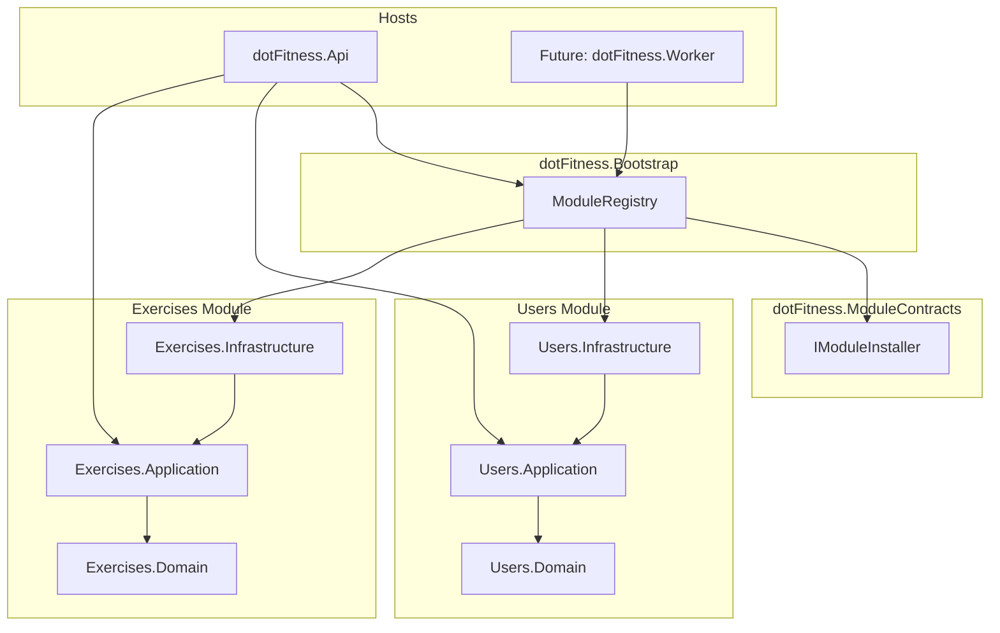

# dotFitness Architecture: Modular Monolith with DDD

> Based on industry best practices from [modular-monolith-with-ddd](https://github.com/MaiQD/modular-monolith-with-ddd/blob/master/README.md)

## 🏗️ Architectural Overview

dotFitness implements a **Modular Monolith** architecture that combines the simplicity of a monolith with the scalability and maintainability of microservices. This pattern is inspired by Domain-Driven Design (DDD) principles and provides a clear path for future evolution. The architecture leverages a **hybrid database approach** (MongoDB + PostgreSQL) optimized for each module's specific data requirements.

## 🎯 Core Principles

### 1. **Modular Independence**
- Each module is a self-contained vertical slice
- Modules communicate through well-defined interfaces
- No direct dependencies between modules
- Shared concerns are isolated in the SharedKernel

### 2. **Domain-Driven Design**
- Business logic is organized around domain concepts
- Clear boundaries between different business capabilities
- Ubiquitous language reflected in code structure
- Domain entities encapsulate business rules

### 3. **Clean Architecture**
- Dependency inversion principle
- Business logic independent of infrastructure
- Testable and maintainable code structure
- Clear separation of concerns

#### 3.1 Single Responsibility Principle (SRP)
- Each class has exactly one reason to change.
- Split responsibilities into focused classes:
  - Command/Query objects: data-only intent
  - Handlers: application orchestration per request
  - Domain entities: business invariants and behavior
  - Repositories: persistence concerns behind interfaces
  - Mappers: DTO ↔ domain mapping (Mapperly)
  - Validators: FluentValidation rules per command/query

#### 3.2 Layered Concerns
- Domain: Entities, Value Objects, Domain Events, Repository Interfaces
- Application: Commands/Queries, Handlers, DTOs, Mappers, Validators
- Infrastructure: Repository implementations, external services, handlers’ wiring
- API: Controllers, filters/middleware, DI setup

#### 3.3 Class Separation Guidelines
- Keep handlers small; extract complex policies/services into separate application services when logic grows
- Avoid God objects: prefer cohesive domain methods over sprawling services
- No infrastructure dependencies in Domain/Application (use interfaces)
- Keep constructors minimal; prefer injecting abstractions only

#### 3.4 Module Boundaries
- No cross-module domain references; communicate via commands/queries or events
- SharedKernel only for truly cross-cutting abstractions (no domain rules)

#### 3.5 Service Interface Placement
- **Service interfaces belong in the Application layer** as application contracts
- **Service implementations belong in the Infrastructure layer** as concrete implementations
- This ensures proper dependency flow: Application → Infrastructure (not the reverse)
- Handlers depend on Application layer interfaces, not Infrastructure layer contracts

#### 3.5 Testing Implications
- Domain is pure and easily unit-testable
- Application handlers tested with mocked repositories/services
- Infrastructure verified via integration tests

## 📁 Project Structure

```
dotFitness.WorkoutTracker/
├── dotFitness.Api/                    # 🚀 Application Entry Point
│   ├── Controllers/                   # REST API endpoints
│   ├── Infrastructure/               # Cross-cutting concerns
│   │   ├── Metrics/                  # Performance monitoring
│   │   ├── ModuleRegistry.cs         # Dynamic module discovery
│   │   ├── ModuleHealthChecks.cs     # Health monitoring
│   │   └── ModuleConfigurationValidator.cs
│   └── Program.cs                    # Application bootstrap
│
├── dotFitness.SharedKernel/          # 🔗 Shared Components
│   ├── Results/                      # Result pattern implementation
│   ├── Outbox/                       # Outbox pattern for events
│   ├── Interfaces/                   # Common interfaces
│   └── Utilities/                    # Shared utilities
│
└── Modules/                          # 📦 Business Modules
    ├── Users/                        # 👤 User Management Module
    │   ├── dotFitness.Modules.Users.Domain/
    │   ├── dotFitness.Modules.Users.Application/
    │   │   ├── Commands/             # Write operations
    │   │   ├── Queries/              # Read operations
    │   │   ├── DTOs/                 # Data transfer objects
    │   │   ├── Mappers/              # Domain ↔ DTO mapping
    │   │   ├── Validators/           # Input validation
    │   │   └── Services/             # 🆕 Service interfaces (contracts)
    │   ├── dotFitness.Modules.Users.Infrastructure/
    │   │   ├── Handlers/             # Command/Query processors
    │   │   ├── Repositories/         # Data access implementations
    │   │   ├── Services/             # Service implementations
    │   │   └── Configuration/        # Module setup
    │   └── dotFitness.Modules.Users.Tests/
    │
    ├── Exercises/                    # 💪 Exercise Management Module
    │   ├── dotFitness.Modules.Exercises.Domain/
    │   ├── dotFitness.Modules.Exercises.Application/
    │   │   ├── Commands/
    │   │   ├── Queries/
    │   │   ├── DTOs/
    │   │   ├── Mappers/
    │   │   ├── Validators/
    │   │   └── Services/             # 🆕 Service interfaces
    │   ├── dotFitness.Modules.Exercises.Infrastructure/
    │   │   ├── Handlers/
    │   │   ├── Repositories/
    │   │   ├── Services/             # Service implementations
    │   │   └── Configuration/
    │   └── dotFitness.Modules.Exercises.Tests/
    │
    ├── Routines/                     # 📋 Workout Routine Module (Planned)
    │   └── [Future implementation]
    │
    └── WorkoutLogs/                  # 📊 Workout Tracking Module (Planned)
        └── [Future implementation]
```

## 🗄️ Database Architecture Decision

### Hybrid Database Approach

After comprehensive analysis of the dotFitness project requirements, we have chosen a **hybrid database architecture** that leverages both MongoDB and PostgreSQL, with each database optimized for specific module requirements.

#### Decision Rationale

**Why Hybrid?**
- **ACID Compliance**: Critical for user authentication and data integrity (PostgreSQL)
- **Schema Flexibility**: Required for exercise data and workout logs (MongoDB)
- **Query Performance**: Optimized for each module's data patterns
- **Migration Effort**: Minimal disruption to existing system (3-4 days vs 20-30 days)
- **Cost Impact**: Maintains zero-cost deployment strategy

#### Module-to-Database Mapping

**PostgreSQL Modules (Relational Data):**
- **Users Module**: User profiles, authentication, metrics, role management
- **Routines Module** (Future): Workout routines, exercise sequences, templates

**MongoDB Modules (Document Data):**
- **Exercises Module**: Exercise definitions, muscle groups, equipment, search
- **WorkoutLogs Module** (Future): Workout sessions, performance data, analytics

#### Technical Benefits

- **Optimal Performance**: Each database excels at its specific use case
- **Zero Additional Cost**: Both databases have generous free tiers
- **Minimal Migration Effort**: Only migrate 1 module, not 2+
- **Future Flexibility**: Easy to scale each database independently
- **Risk Mitigation**: Gradual migration, not big bang

## 🧩 Module Structure

Each module follows a consistent internal structure:

### Domain Layer (`*.Domain`)
```csharp
// Core business entities
public class User : IEntity
{
    public string Id { get; set; }
    public string GoogleId { get; set; }
    public string Email { get; set; }
    // Business logic and validation
}

// Domain events
public class UserCreatedEvent : INotification
{
    public string UserId { get; set; }
    public string Email { get; set; }
}

// Repository interfaces
public interface IUserRepository
{
    Task<User?> GetByIdAsync(string id);
    Task<User?> GetByGoogleIdAsync(string googleId);
    Task CreateAsync(User user);
    Task UpdateAsync(User user);
}
```

### Application Layer (`*.Application`)
```csharp
// Commands (write operations)
public class CreateUserCommand : IRequest<Result<UserDto>>
{
    public string GoogleId { get; set; }
    public string Email { get; set; }
    public string DisplayName { get; set; }
}

// Queries (read operations)
public class GetUserByIdQuery : IRequest<Result<UserDto>>
{
    public string UserId { get; set; }
}

// DTOs (Data Transfer Objects)
public class UserDto
{
    public string Id { get; set; }
    public string Email { get; set; }
    public string DisplayName { get; set; }
}

// Mappers (static for performance)
public static class UserMapper
{
    public static UserDto ToDto(User user) => new()
    {
        Id = user.Id,
        Email = user.Email,
        DisplayName = user.DisplayName
    };
}

// Service interfaces (application contracts)
public interface IUserService
{
    Task<Result<User>> GetOrCreateUserAsync(GoogleUserInfo googleUserInfo, CancellationToken cancellationToken = default);
}

public interface IGoogleAuthService
{
    Task<GoogleUserInfo?> GetUserInfoAsync(string accessToken, CancellationToken cancellationToken = default);
}

public interface IJwtService
{
    string GenerateToken(User user);
    DateTime GetExpirationTime();
}
```

### Service Architecture & Interface Placement
**Service interfaces belong in the Application layer** as application contracts that define the behavior expected by the application. This follows Clean Architecture principles:

```csharp
// ✅ CORRECT: Application layer defines service contracts
namespace dotFitness.Modules.Users.Application.Services;

public interface IUserService
{
    Task<Result<User>> GetOrCreateUserAsync(GoogleUserInfo googleUserInfo, CancellationToken cancellationToken = default);
}

public interface IGoogleAuthService
{
    Task<GoogleUserInfo?> GetUserInfoAsync(string accessToken, CancellationToken cancellationToken = default);
}

public interface IJwtService
{
    string GenerateToken(User user);
    DateTime GetExpirationTime();
}
```

**Service implementations belong in the Infrastructure layer** as concrete implementations:

```csharp
// ✅ CORRECT: Infrastructure layer implements Application contracts
namespace dotFitness.Modules.Users.Infrastructure.Services;

public class UserService : IUserService  // Implements Application interface
{
    // Implementation details...
}

public class GoogleAuthService : IGoogleAuthService  // Implements Application interface
{
    // Implementation details...
}
```

**Why this placement matters:**
- **Dependency Inversion**: Application layer defines contracts, Infrastructure implements them
- **No Circular Dependencies**: Clear one-way dependency flow
- **Clean Testing**: Application layer can be tested with mocked services
- **Proper Separation**: Business logic doesn't depend on technical implementation details

### Infrastructure Layer (`*.Infrastructure`)
```csharp
// Command/Query handlers
public class CreateUserCommandHandler : IRequestHandler<CreateUserCommand, Result<UserDto>>
{
    private readonly IUserRepository _userRepository;
    private readonly IMediator _mediator;

    public async Task<Result<UserDto>> Handle(CreateUserCommand request, CancellationToken cancellationToken)
    {
        // Business logic implementation
        var user = new User { /* ... */ };
        await _userRepository.CreateAsync(user);
        
        // Publish domain event
        await _mediator.Publish(new UserCreatedEvent { UserId = user.Id });
        
        return Result<UserDto>.Success(UserMapper.ToDto(user));
    }
}

// Repository implementations
public class UserRepository : IUserRepository
{
    private readonly IMongoCollection<User> _collection;

    public async Task<User?> GetByIdAsync(string id)
    {
        return await _collection.Find(u => u.Id == id).FirstOrDefaultAsync();
    }
    // Other repository methods...
}

// Service implementations (implements Application layer interfaces)
public class UserService : IUserService
{
    private readonly IUserRepository _userRepository;
    
    public async Task<Result<User>> GetOrCreateUserAsync(GoogleUserInfo googleUserInfo, CancellationToken cancellationToken = default)
    {
        // Implementation of application service contract
        // ...
    }
}

public class GoogleAuthService : IGoogleAuthService
{
    public async Task<GoogleUserInfo?> GetUserInfoAsync(string accessToken, CancellationToken cancellationToken = default)
    {
        // Implementation of application service contract
        // ...
    }
}
```

## 🔧 Module Registration & Composition (Decision Update)

We moved from reflection-based assembly scanning to explicit, type-safe installers with a dedicated composition root.

- Interface: moved to `dotFitness.ModuleContracts` as `IModuleInstaller`
- Composition Root: `dotFitness.Bootstrap` registers modules and shared infra
- API: references only Bootstrap (and Application projects) to stay “pure”
- Modules: keep installers in each `*.Infrastructure`

### Why this design?
- Type safety and compile-time validation (no reflection)
- API remains clean; wiring centralized and reusable across hosts (API, Worker)
- Future microservices: Bootstrap and installer contracts mirror per-service wiring

### Trade-offs
- One more project (Bootstrap) and a small contracts package
- Bootstrap must reference module Infrastructure (outer layer dependency)

### Diagram


### Key Boundary: No inward dependencies
- Domain/Application don’t depend on Infrastructure
- Modules don’t reference each other’s Domains
- Cross-module via Application DTOs or Inbox/Outbox events

### Dependency Flow & Service Architecture
```
Application Layer (Service Interfaces)
    ↑ (depends on)
Infrastructure Layer (Service Implementations)
    ↑ (implements)
Application Layer (Handlers use interfaces)
```

**Correct Service Placement:**
- **Service Interfaces**: `*.Application/Services/` - Define application contracts
- **Service Implementations**: `*.Infrastructure/Services/` - Implement those contracts
- **Handlers**: Depend on Application layer interfaces, not Infrastructure contracts

**Benefits of Correct Placement:**
- ✅ Clean dependency flow (Application → Infrastructure)
- ✅ No circular dependencies
- ✅ Easy testing with mocked services
- ✅ Follows Clean Architecture principles

## 🔄 Module Registration System

### Automatic Discovery
The `ModuleRegistry` automatically discovers and registers all modules:

```csharp
// Zero-configuration module registration
public static readonly string[] ModuleNames = 
{
    "Users",
    "Exercises", 
    "Routines",
    "WorkoutLogs"
};

// Automatic registration in Program.cs
ModuleRegistry.RegisterAllModules(services, configuration);
ModuleRegistry.RegisterModuleAssemblies(mediatRConfig);
```

### Dynamic Assembly Loading
- **Application Assemblies**: Loaded for CQRS handlers and DTOs
- **Infrastructure Assemblies**: Loaded for repository implementations
- **Health Checks**: Automatic health monitoring for each module
- **Metrics**: Performance tracking and monitoring

## 🎨 Design Patterns

### 1. **CQRS (Command Query Responsibility Segregation)**
- **Commands**: Intent to change state (`CreateUserCommand`)
- **Queries**: Intent to retrieve data (`GetUserByIdQuery`)
- **Handlers**: Process commands/queries (`CreateUserCommandHandler`)
- **Benefits**: Clear separation, optimized read/write paths

### 2. **Result Pattern**
```csharp
// Explicit success/failure handling
public async Task<Result<UserDto>> Handle(CreateUserCommand request)
{
    if (await _userRepository.ExistsAsync(request.Email))
        return Result<UserDto>.Failure("User already exists");
    
    var user = new User { /* ... */ };
    await _userRepository.CreateAsync(user);
    return Result<UserDto>.Success(UserMapper.ToDto(user));
}
```

### 3. **Outbox Pattern**
- Ensures reliable event publishing
- Stores events in database transaction
- Background processing for event delivery
- Prevents data inconsistency

#### Design Choice: Direct Collection Access vs Repository Abstraction

For the Outbox pattern, we use `IMongoCollection<OutboxMessage>` directly instead of creating an `IOutboxRepository`:

```csharp
// Current approach (recommended):
public class UpdateUserProfileCommandHandler 
{
    private readonly IUserRepository _userRepository;           // Domain concept
    private readonly IMongoCollection<OutboxMessage> _outboxCollection; // Infrastructure pattern
}
```

**Why direct collection access?**

1. **Outbox is Infrastructure, Not Domain**: The Outbox pattern is a technical concern for reliable event delivery, not a domain concept that needs abstraction.

2. **YAGNI Principle**: Outbox operations are simple INSERTs in command handlers. Creating a repository would be over-abstraction for such basic operations.

3. **Clear Intent**: Direct collection access makes it obvious this is infrastructure-level event storage, not domain logic.

4. **Performance**: No unnecessary abstraction overhead for simple operations.

**When to use Repository Pattern vs Direct Access:**
- **Repository Pattern**: For domain entities (User, Exercise) with complex queries and business logic
- **Direct Collection Access**: For infrastructure patterns (Outbox, Inbox) with simple CRUD operations

**Alternative considered**: An `IEventDispatcher` abstraction could provide better testability while maintaining simplicity:
```csharp
public interface IEventDispatcher
{
    Task DispatchAsync<T>(T domainEvent) where T : class;
}
```
This remains a valid option for future refactoring if enhanced testability is needed.

### 4. **Static Mappers**
```csharp
// Compile-time mapping for zero runtime overhead
public static class UserMapper
{
    public static UserDto ToDto(User user) => new()
    {
        Id = user.Id,
        Email = user.Email,
        DisplayName = user.DisplayName
    };
}
```

## 🔗 Module Communication

### 1. **Synchronous Communication**
- Direct method calls within the same module
- Interface-based communication between layers
- No direct dependencies between different modules

### 2. **Asynchronous Communication (Event-Driven)**
- Domain events for cross-module communication.
- **Outbox pattern** for reliable event publishing by the producing module.
- **Inbox pattern** for idempotent processing by consuming modules:
  - Each consumer records processed `eventId`s in its `inboxMessages` to avoid duplicates.
  - Handlers are idempotent and retriable.
- Event handlers for side effects and projections (read models).

### 3. **Shared Kernel**
- Common interfaces (`IEntity`)
- Result pattern implementation
- Shared utilities and constants
- No business logic in shared components

## 🧪 Testing Strategy

### Unit Testing
```csharp
[Fact]
public async Task Handle_ValidCommand_ReturnsSuccess()
{
    // Arrange
    var command = new CreateUserCommand { /* ... */ };
    var handler = new CreateUserCommandHandler(_mockRepo, _mockMediator);

    // Act
    var result = await handler.Handle(command, CancellationToken.None);

    // Assert
    result.IsSuccess.Should().BeTrue();
    result.Value.Should().NotBeNull();
}
```

### Integration Testing
- MongoDB integration with Testcontainers
- Full module testing with real dependencies
- API endpoint testing with HTTP client

### Test Structure
```
dotFitness.Modules.Users.Tests/
├── Domain/           # Entity and business logic tests
├── Application/      # Command/Query handler tests
├── Infrastructure/   # Repository and external service tests
└── MongoDB/          # Database integration tests
```

## 📊 Monitoring & Observability

### Health Checks
- Module-specific health endpoints
- Database connectivity monitoring
- External service health checks

### Metrics
- Module registration performance
- Assembly loading times
- MediatR handler registration
- MongoDB index configuration

### Logging
- Structured logging with Serilog
- Module-specific log contexts
- Performance and error tracking

## 🚀 Deployment & Scalability

### Current State
- Single deployment unit (monolith)
- Shared database (MongoDB)
- Horizontal scaling through load balancing

### Future Evolution Path
1. **Module Extraction**: Extract modules to separate services
2. **Database Separation**: Split databases per module
3. **Event-Driven Architecture**: Implement message brokers
4. **API Gateway**: Centralized routing and authentication

## 🎯 Benefits of This Architecture

### Development Benefits
- **Clear Boundaries**: Each module has well-defined responsibilities
- **Team Autonomy**: Teams can work on different modules independently
- **Testability**: Isolated testing of business logic
- **Maintainability**: Changes are localized to specific modules

### Operational Benefits
- **Simple Deployment**: Single application to deploy and monitor
- **Shared Infrastructure**: Common database, logging, and monitoring
- **Cost Effective**: Lower operational overhead than microservices
- **Performance**: No network latency between modules

### Business Benefits
- **Rapid Development**: New features can be added quickly
- **Risk Mitigation**: Changes in one module don't affect others
- **Scalability**: Can scale horizontally or extract modules as needed
- **Technology Flexibility**: Different modules can use different technologies

## 📚 References

- [Modular Monolith with DDD](https://github.com/MaiQD/modular-monolith-with-ddd/blob/master/README.md) - Reference implementation
- [Domain-Driven Design](https://martinfowler.com/bliki/DomainDrivenDesign.html) - Core concepts
- [Clean Architecture](https://blog.cleancoder.com/uncle-bob/2012/08/13/the-clean-architecture.html) - Architectural principles
- [CQRS Pattern](https://martinfowler.com/bliki/CQRS.html) - Command Query Responsibility Segregation 